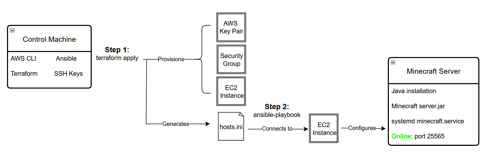

# AWS Minecraft Server Automation

## Background

This project follows an Infrastructure as Code approach to automate the provisioning, configuration, and deployment of a Minecraft server hosted on AWS infrastructure. The overall goal is to deploy the server entirely through code without interacting with the AWS Management Console.

Terraform is used to provision AWS resources, namely an EC2 instance and security group, along with handling an SSH key pair configuration. It also dynamically generates the ```hosts.ini``` file used by Ansible.

Ansible configures the instance by installing Java, downloading the Minecraft server files, and configuring the server as a persistent systemd service. The service is configured to automatically restart when the EC2 instance reboots.

This project was developed on Windows 11 using WSL Ubuntu as a Linux control environment.


## Requirements

### Required Tools

- [AWS CLI](https://docs.aws.amazon.com/cli/latest/userguide/getting-started-install.html)
- [Terraform](https://developer.hashicorp.com/terraform/tutorials/aws-get-started/install-cli)
- [Ansible](https://docs.ansible.com/projects/ansible/latest/installation_guide/installation_distros.html)


### AWS Credentials

Valid AWS credentials must be configured locally before running Terraform.

Example:
```
aws configure
```


### SSH Key Setup

A key pair is required for Ansible to configure the server instance. Terraform imports the public key into AWS as a key pair resource, while the private key remains on the local control machine.

Use an existing key or generate a new one:

```
ssh-keygen -t ed25519 -f ~/.ssh/minecraft-server-key
```

### Terraform Variables

Create a new file named ```terraform.tfvars``` inside the ```terraform/``` directory, replacing the placeholder values:

```
ssh_cidr_ipv4       = "YOUR.PUBLIC.IP.ADDRESS/32"
ssh_public_key_path = "YOUR_PUBLIC_KEY_PATH.pub"
```

```ssh_cidr_ipv4``` is the public IPv4 address or CIDR block allowed to SSH into the EC2 instance. Using ```/32``` restricts access to a single IP rather than a range. Change as desired.

```ssh_public_key_path``` is the path to the SSH public key generated earlier or of the existing public key of your choice. Make sure to include the ```.pub``` file extension.


## Pipeline Diagram




## Commands to Run

Initialize and apply Terraform to provision the AWS infrastructure. This provisions the EC2 instance, security group, and AWS key pair resources.
```
cd terraform
terraform init
terraform apply
```

After running ```terraform apply```, the public IPv4 address of the new EC2 instance is output to the terminal. Terraform also generates the ```ansible/hosts.ini``` file the public IP address and configured SSH key path variable. This file is then used by Ansible to connect to the EC2 instance automatically.

Run the Ansible ```deploy.yml``` playbook to deploy and configure the Minecraft server. The playbook installs Java, downloads Minecraft server files, accepts the required EULA, starts the Minecraft server, and configures the ```minecraft``` systemd service for automatic startup on reboot.
```
cd ../ansible
ansible-playbook -i hosts.ini deploy.yml
```


## Connecting to the Minecraft Server

Once the Ansible server deployment script completes, connect via the Minecraft launcher using the EC2 public IPv4 address output by Terraform in the terminal (```PUBLIC_IP:25565```).

Connection can also be tested without launching the actual game:
```
nmap -sV -Pn -p T:25565 <SERVER_PUBLIC_IP>
```


## Resources / Sources

 - [Terraform Tutorial: Get Started - AWS](https://developer.hashicorp.com/terraform/tutorials/aws-get-started)

 - [Terraform AWS Provider Documentation](https://registry.terraform.io/providers/hashicorp/aws/latest/docs)

 - [Ansible Documentation](https://docs.ansible.com/projects/ansible/latest/getting_started/index.html)

 - [Official Minecraft Java Server Download Page](https://www.minecraft.net/en-us/download/server)

 - [Safer systemd Shutdown Settings](https://kibitkin.info/minecraft-systemd-autostart/)

 - [Minecraft systemd Service Example](https://www.shells.com/l/en-US/tutorial/0-A-Guide-to-Installing-a-Minecraft-Server-on-Linux-Ubuntu)

 - [How to Create Ansible Inventory from Terraform](https://oneuptime.com/blog/post/2025-12-18-create-ansible-inventory-from-terraform/view)

 
